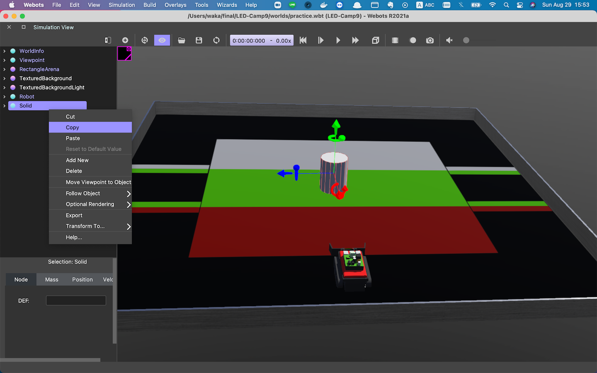
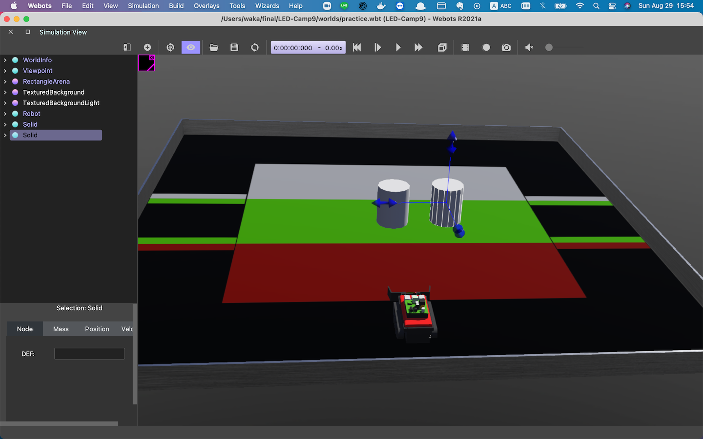

# Led Camp9

## LED-Camp ControllerクラスAPI

以下ではLED-Campの実習に使用するControllerクラスのAPIを中心に説明する。


## 自己位置

### **`Controller::getPosition`**

引数: なし  
返値: PositionValue{float distance, angle}  
振舞: 現在の進んだ距離・角度を格納するPositionValue型変数を返す  
(`distance`は**cm単位の**浮動小数点数，`angle`は**時計回り方向を**正とする度数単位の浮動小数点数)

```cpp
positionValue = controller->getPosition(); //回転角センサから移動距離・角度を取得し代入
```

### **`Controller::positionReset`**

引数: なし  
返値: なし  
振舞: 回転角センサの保持する取得値をリセットする  
(= `distance`および`angle`をともに0に戻す)

```cpp
controller->positionReset(); //センサから取得する距離・回転角の値を0にリセット
```


## モータ制御

### **`Controller::changeDriveMode`**


引数: Mode mode, int motorPower  
返値: なし  
振舞: Mode (FORWARD, BACKWARD, STOP, CW, CCWのいずれか) のパターンにmotorPowerの回転速度でモータを回転させる  
(引数motorPowerには0-100の範囲の整数値をとる)
※CWはclockwise（時計回り），CCWはcounterclockwise（反時計回り）の略である

```cpp
controller->changeDriveMode(FORWARD,100); //パワー100で前進する移動モードに切り替え
```

## 距離センサ

### **`Controller::getRange`**

引数: なし  
返値: float  
振舞: 距離センサから取得した値を返す    
(値は**cm単位**の正の浮動小数点数)

```cpp
range = controller->getRange(); //距離センサから値を取得・代入
```

## ラインセンサ

### **`Controller::getLineValue`**


引数 なし  
返値: LineValue{int left, center, right}  
振舞: ラインセンサの白黒判定（0or1, 黒が0）を格納するLineValue型変数を返す  

```cpp
lineValue = controller->getLineValue(); //ラインセンサから値を取得・代入
```


## カラーセンサ

### **`Controller::getColorValue`**

引数: なし  
返値: ColorValue{unsigned int red, green, blue}  
振舞: カラーセンサの読み取る色の値（R,G,B, それぞれ0~255の範囲の整数値）を構造体に入れて返す  

```cpp
colorValue = controller->getColorValue(); //カラーセンサから値を取得・代入
```

## その他

### **`Controller::tankSleep`**

引数: int msec
返値: なし
振舞: msecミリ秒間sleepする（シミュレーションの時間は流れたまま）

```cpp
controller->tankSleep(1000); // 1秒間sleepする
```

### **`printValues`**

引数: なし
返値: なし
振舞: 取得しているセンサ値をコンソールに出力する

```cpp
printValues();　//LEDTankが保持するセンサの値をコンソールに出力する
```

## 発生イベント一覧

### 競技会で使用可能なもの
### **`E_CHANGE_DISTANCE`**
エンコーダで読み取る値から計算する，Tankの移動距離が変わった時に`true`になる
### **`E_CHANGE_ANGLE`**
エンコーダで読み取る値から計算する，Tankの回転角が変わったときに`true`になる
### **`E_CHANGE_RANGING`**
距離センサで読み取る距離の値が変わった時に`true`になる  
(ノイズを考慮し，変化の度合いが微小な時は発生しない)
### **`E_CHANGE_AREA`**
ラインセンサから読み取る値のいずれかが変わった時に`true`になる
### **`E_CHANGE_COLOR`**
カラーセンサから読み取るrgb値のいずれかが変わった時に`true`になる
### **`E_TRUE`**
常に`true`になる
### **`E_FALSE`**
常に`false`になる．

### キーイベント（デバッグ用途，競技会では使用禁止）
競技会では，ソフトウェアを実行委員上のPCで実行する．  
このため，キーイベントは競技中発生しないことに注意されたい
### **`E_UP`**
キーボードのWを押したときに`true`になる
### **`E_DOWN`**
キーボードのSを押したときに`true`になる
### **`E_LEFT`**
キーボードのAを押したときに`true`になる
### **`E_RIGHT`**
キーボードのDを押したときに`true`になる
## 競技会練習用環境へのブロック追加

競技会練習用環境は、初期環境としてLED-Tankと円柱ブロックが1つ存在した状態である。
実際の競技会ではブロック数が7個のためブロックを適宜追加しながらの開発が考えられる。 
以下にブロックの追加方法を示す。

1. webots を起動し、File＞open world から開発用環境(practice.wbt)を選択して開く。

2. webots上の時間が0になっていることを確認、0でなければResetSimurationする（⌘＋Shift＋T　or Ctrl + Shift + T）

3. 左側にあるシーンツリーのSolidを選択し、copy & pasteする
    <p></p>

4. 2つのブロックが重なった状態になっているので見た目で2つあることはわからない。見えているブロックを選択しShiftを押しながら、横にスライドさせる。
    <p></p>

5. 3-4 を繰り返し必要個数だけブロックを生成し保存する。(⌘+Shift+S or Ctrl + Shift + S)
